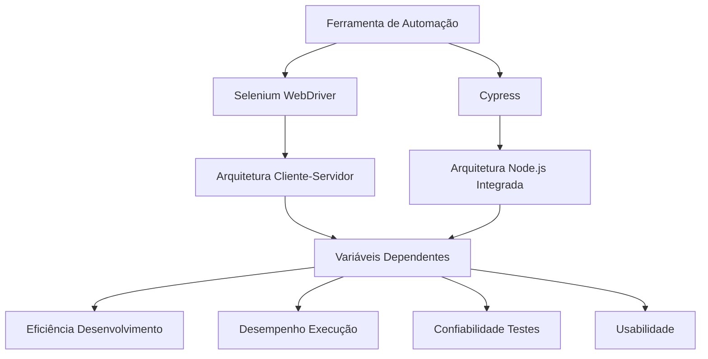
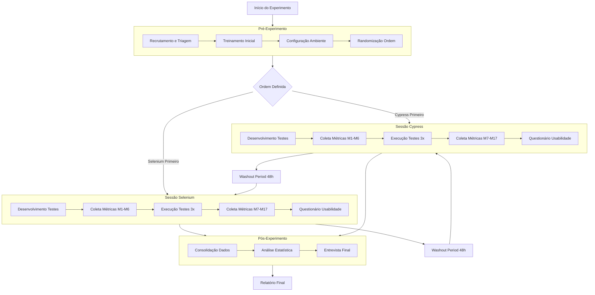

# Medicao-Trabalho-Final

# Plano de Experimento – Scoping e Planejamento

## **1. Identificação básica**

## **1.1 Título do experimento**
Avaliação comparativa de técnicas de testes automatizados (Selenium vs. Cypress) em um aplicativo web.

## **1.2 ID / código**
EXP-TST-AUTO-001

## **1.3 Versão do Documento e Histórico de Revisão**
- v1.0 (23/11/2025) — Versão inicial.
- v1.1 (24/11/2025) — Adição de tabelas GQM e métricas detalhadas.
- v1.2 (28/11/2025)-  Adição de modelo conceitual, variáveis, desenho experimental, população e sujeitos, instrumentação, protocolo operacional e plano de análise de dados.

## **1.4 Datas (criação, última atualização)**
- Criação: 23/11/2025
- Última atualização: 28/11/2025

## **1.5 Autores (nome, área, contato)**
Gabriel Oliveira – Engenharia de Software – gabrielfoliveira@hotmail.com

## **1.6 Responsável principal (PI / dono do experimento)**
Gabriel Oliveira

## **1.7 Projeto / produto / iniciativa relacionada**

* **Projeto de pesquisa aplicado em Engenharia de Software**, com foco na melhoria de processos de qualidade.
* Relacionado a **ferramentas de automação de testes** utilizadas para apoiar o desenvolvimento e aumentar a produtividade das equipes.
* Contribui para a tomada de decisão sobre **seleção de ferramentas** em ambientes reais de desenvolvimento de software.

## **2. Contexto e Problema**

## **2.1 Descrição do problema / oportunidade**

Equipes de desenvolvimento frequentemente enfrentam dificuldade para definir qual ferramenta utilizar na automação de testes funcionais. As ferramentas mais populares, **Selenium** e **Cypress**, apresentam diferentes vantagens, mas não há consenso sobre qual oferece **melhor eficácia**, **tempo de execução menor** e **mais estabilidade**.
O experimento busca responder essa lacuna comparando as duas ferramentas em condições controladas.

---

## **2.2 Contexto organizacional e técnico**

O experimento será conduzido em um **aplicativo web simples**, representativo de cenários comuns do mercado.
O ambiente inclui:

* pipeline de desenvolvimento padrão;
* execução dos testes em máquina local;
* ferramentas **open-source**;
* foco em **testes funcionais automatizados**.
  O propósito é simular a realidade de uma equipe que precisa escolher a ferramenta mais adequada sem grandes investimentos.

---

## **2.3 Trabalhos e evidências prévias (internos e externos)**

A base do experimento inclui:

* documentação oficial do **Selenium** e do **Cypress**;
* estudos acadêmicos sobre automação de testes e qualidade de software;
* benchmarks existentes na literatura que analisam desempenho, manutenção e estabilidade;
* relatos de uso das ferramentas por desenvolvedores em empresas e comunidades técnicas.
  Essas evidências mostram a relevância prática e acadêmica da comparação.

---

## **2.4 Referencial teórico e empírico essencial**

Os principais conceitos que embasam o experimento incluem:

* **Testes funcionais automatizados** e suas etapas;
* **Métricas de qualidade de software** (tempo de execução, taxa de falhas, manutenibilidade);
* Modelo **GQM (Goal–Question–Metric)** para estruturar objetivos e métricas;
* Comparações empíricas de ferramentas de automação realizadas em artigos científicos;
* Características técnicas das ferramentas, como arquitetura, API, linguagem de scripting e suporte à comunidade.

## 3. Objetivos e Questões (GQM)

## 3.1 Objetivo Geral
Analisar as ferramentas Selenium WebDriver e Cypress com o propósito de caracterizar sua eficácia, eficiência e usabilidade sob a perspectiva do desenvolvedor/testador no contexto de projetos de automação de testes web em aplicações de pequeno e médio porte.

## 3.2 Objetivos Específicos
- **O1:** Comparar a eficiência no desenvolvimento de testes
- **O2:** Avaliar o desempenho na execução dos testes
- **O3:** Mensurar a confiabilidade e estabilidade dos testes
- **O4:** Analisar a usabilidade e facilidade de manutenção

## 3.3 Tabela GQM (Goal-Question-Metric)

| Objetivo | Pergunta | Métricas |
|----------|----------|----------|
| **O1:** Eficiência no desenvolvimento | Q1.1: Qual ferramenta permite desenvolvimento mais rápido? | M1, M2 |
| | Q1.2: Qual ferramenta requer menos esforço cognitivo? | M3, M4 |
| | Q1.3: Qual ferramenta possui melhor integração com ferramentas de desenvolvimento? | M5, M6 |
| **O2:** Desempenho na execução | Q2.1: Qual ferramenta executa testes mais rapidamente? | M7, M8 |
| | Q2.2: Qual ferramenta consome menos recursos computacionais? | M9, M10 |
| | Q2.3: Qual ferramenta escala melhor com aumento de testes? | M7, M11 |
| **O3:** Confiabilidade e estabilidade | Q3.1: Qual ferramenta produz testes mais estáveis? | M12, M13 |
| | Q3.2: Qual ferramenta possui melhor tratamento de elementos assíncronos? | M14, M15 |
| | Q3.3: Qual ferramenta oferece melhor feedback em falhas? | M16, M17 |
| **O4:** Usabilidade e manutenção | Q4.1: Qual ferramenta é mais fácil de aprender? | M18, M19 |
| | Q4.2: Qual ferramenta facilita a depuração? | M20, M21 |
| | Q4.3: Qual ferramenta possui documentação mais eficaz? | M22, M23 |

## 3.4 Tabela de Métricas Detalhadas

| Métrica | Descrição | Unidade |
|---------|------------|---------|
| **M1** - Tempo de desenvolvimento | Tempo total para implementar conjunto padrão de testes | Horas |
| **M2** - Velocidade de codificação | Número de linhas de código por hora | LOC/hora |
| **M3** - Complexidade cognitiva | Pontuação em escala de complexidade percebida | Pontos (1-5) |
| **M4** - Curva de aprendizado | Tempo para implementar primeiro teste funcional | Minutos |
| **M5** - Integração com IDE | Facilidade de configuração e uso com VS Code | Pontos (1-5) |
| **M6** - Qualidade de autocompletar | Eficácia do autocompletar e sugestões de código | Pontos (1-5) |
| **M7** - Tempo de execução total | Tempo para executar suite completa de testes | Segundos |
| **M8** - Tempo médio por teste | Tempo médio de execução por teste individual | Segundos/teste |
| **M9** - Uso de CPU | Percentual de uso da CPU durante execução | Percentual (%) |
| **M10** - Uso de memória RAM | Consumo de memória durante execução | Megabytes (MB) |
| **M11** - Overhead de execução | Tempo adicional por teste ao aumentar suite | Segundos/teste |
| **M12** - Taxa de sucesso | Percentual de testes que passam consistentemente | Percentual (%) |
| **M13** - Flaky tests | Número de testes com comportamento inconsistente | Quantidade |
| **M14** - Estabilidade em waits | Eficácia no tratamento de elementos dinâmicos | Pontos (1-5) |
| **M15** - Timeouts necessários | Número de waits explícitos necessários | Quantidade |
| **M16** - Clareza de mensagens | Qualidade das mensagens de erro | Pontos (1-5) |
| **M17** - Screenshots automáticos | Qualidade e utilidade de screenshots automáticos | Pontos (1-5) |
| **M18** - Facilidade inicial | Facilidade para configuração inicial | Pontos (1-5) |
| **M19** - Intuitividade da API | Facilidade para entender e usar a API | Pontos (1-5) |
| **M20** - Ferramentas de debug | Qualidade das ferramentas de depuração | Pontos (1-5) |
| **M21** - Logs detalhados | Utilidade dos logs gerados | Pontos (1-5) |
| **M22** - Qualidade documentação | Clareza e completude da documentação | Pontos (1-5) |
| **M23** - Exemplos práticos | Qualidade e quantidade de exemplos | Pontos (1-5) |

## 4. Escopo e Contexto do Experimento

## 4.1 Escopo Funcional/de Processo
**Incluído:**
- Testes das funcionalidades: Login, CRUD de produtos, carrinho de compras, checkout
- Desenvolvimento de testes idênticos em ambas ferramentas
- Coleta de todas as 23 métricas definidas
- Análise qualitativa e quantitativa

**Excluído:**
- Testes de performance (carga/stress)
- Testes de segurança
- Testes cross-browser
- Integração com CI/CD complexa

## 4.2 Contexto do Estudo
Experimento acadêmico conduzido por único pesquisador com experiência intermediária em desenvolvimento web e conhecimentos básicos em ambas ferramentas, simulando cenário de adoção inicial em pequenas equipes.

## 4.3 Premissas
- Aplicação web demo permanece estável durante experimento
- Ambiente de desenvolvimento consistentemente configurado
- Documentações oficiais são fontes confiáveis

## 4.4 Restrições
- Tempo máximo: 4 semanas
- Recursos: 1 computador pessoal
- Orçamento: zero (ferramentas open-source)

## 4.5 Limitações Previstas
- Resultados limitados a aplicações web similares à demo
- Percepções subjetivas de único pesquisador
- Ambiente controlado pode não refletir ambientes corporativos

## 5. Stakeholders e Impacto Esperado

## 5.1 Stakeholders Principais
- Pesquisador/autor do TCC
- Orientador acadêmico
- Comunidade de desenvolvedores/testadores
- Equipes de desenvolvimento de software

## 5.2 Interesses e Expectativas
- Evidências concretas para seleção de ferramentas
- Entendimento de trade-offs entre Selenium e Cypress
- Diretrizes para adoção em diferentes cenários

## 5.3 Impactos Potenciais
- Influência na decisão de ferramentas em projetos futuros
- Melhor entendimento dos pontos fortes e fracos de cada ferramenta
- Redução de tempo e custo em processos de seleção tecnológica

## 6. Riscos de Alto Nível e Critérios de Sucesso

## 6.1 Riscos de Alto Nível
- **Técnico:** Instabilidade na aplicação demo
- **Tempo:** Não conclusão dentro do prazo do TCC
- **Validade:** Resultados não generalizáveis

## 6.2 Critérios de Sucesso Globais
- Coleta completa de pelo menos 20 das 23 métricas
- Análise estatisticamente significativa das métricas quantitativas
- Documentação clara dos procedimentos e resultados

## 6.3 Critérios de Parada Antecipada
- Impossibilidade de configurar ambas ferramentas
- Problemas críticos na aplicação demo não resolvíveis
- Restrições de tempo que impossibilitem coleta mínima de dados

## 7. Modelo Conceitual e Hipóteses

### 7.1 Modelo Conceitual do Experimento

O modelo conceitual proposto estabelece que as diferenças arquiteturais entre Selenium WebDriver (arquitetura cliente-servidor) e Cypress (arquitetura única em Node.js) resultam em impactos significativos em quatro dimensões principais de avaliação:

### 7.2 Hipóteses Formais (H0, H1)

| Hipótese | Nulo (H0) | Alternativo (H1) | Direção |
|----------|-----------|------------------|---------|
| **H1** | Não há diferença no tempo de desenvolvimento entre as ferramentas | Cypress requer menos tempo de desenvolvimento que Selenium | Unicaudal |
| **H2** | Não há diferença no tempo de execução dos testes | Cypress executa testes mais rapidamente que Selenium | Unicaudal |
| **H3** | Não há diferença na estabilidade dos testes | Selenium produz testes mais estáveis que Cypress | Unicaudal |
| **H4** | Não há diferença na usabilidade percebida | Cypress possui melhor usabilidade que Selenium | Unicaudal |

### 7.3 Nível de Significância e Considerações de Poder
- **Nível de significância (α):** 0.05
- **Poder estatístico (1-β):** 80% (mínimo)
- **Tamanho de efeito considerado relevante:** d = 0.8 (grande efeito)
- **Justificativa:** Considerando a natureza exploratória do estudo e restrições de amostra, optou-se por detectar apenas efeitos grandes.

## 8. Variáveis, Fatores, Tratamentos e Objetos de Estudo

### 8.1 Objetos de Estudo
- **Aplicação Web:** Sauce Demo (https://www.saucedemo.com/)
- **Scripts de Teste:** 5 casos de teste funcionais (login, navegação, adição ao carrinho, checkout, logout)
- **Ambiente:** Windows 11, Node.js 18+, Chrome 119+

### 8.2 Sujeitos / Participantes (Visão Geral)
- **Perfil:** Desenvolvedor full-stack com experiência intermediária
- **Quantidade:** 1 pesquisador (estudo piloto)
- **Experiência:** 2+ anos em desenvolvimento web, conhecimentos básicos em ambas ferramentas

### 8.3 Tabela de Variáveis Independentes (Fatores) e Seus Níveis

| Fator | Níveis | Descrição |
|-------|--------|-----------|
| **Ferramenta de Automação** | Selenium WebDriver | Framework tradicional com arquitetura cliente-servidor |
| | Cypress | Framework moderno com arquitetura integrada Node.js |
| **Ordem de Aplicação** | Selenium → Cypress | Grupo A: Exposto primeiro ao Selenium |
| | Cypress → Selenium | Grupo B: Exposto primeiro ao Cypress |

### 8.4 Tabela de Tratamentos (Condições Experimentais)

| Tratamento | Descrição | Combinações |
|------------|-----------|-------------|
| **Controle** | Selenium WebDriver com WebDriverIO | Ferramenta: Selenium Binding: WebDriverIO Linguagem: JavaScript |
| **Experimental** | Cypress Framework | Ferramenta: Cypress Versão: 13.6.0 Linguagem: JavaScript |

### 8.5 Tabela de Variáveis Dependentes (Respostas)

| Variável | Métrica | Descrição | Unidade |
|----------|---------|-----------|---------|
| **Tempo Desenvolvimento** | M1 | Tempo total para implementar testes | Horas |
| **Velocidade Codificação** | M2 | Linhas de código por hora | LOC/hora |
| **Tempo Execução** | M7 | Tempo total execução suite | Segundos |
| **Uso CPU** | M9 | Percentual médio de uso da CPU | % |
| **Taxa Sucesso** | M12 | Percentual de testes bem-sucedidos | % |
| **Flaky Tests** | M13 | Número de testes inconsistentes | Quantidade |
| **Facilidade Uso** | M18 | Pontuação em escala Likert | 1-5 |

### 8.6 Variáveis de Controle / Bloqueio

| Variável | Método de Controle | Justificativa |
|----------|-------------------|---------------|
| **Hardware** | Mesmo computador para todos testes | Eliminar variação de performance |
| **Aplicação** | mesma versão Sauce Demo | Consistência do sistema sob teste |
| **Navegador** | Chrome versão 119 | Eliminar variações entre browsers |
| **Conhecimento Prévio** | Treinamento padronizado | Reduzir viés de aprendizado |

### 8.7 Possíveis Variáveis de Confusão Conhecidas

| Variável | Efeito Potencial | Estratégia de Mitigação |
|----------|------------------|------------------------|
| **Fadiga** | Pior performance no segundo tratamento | Contrabalanceamento da ordem |
| **Learning Effect** | Melhora performance no segundo tratamento | Período de washout |
| **Variações Ambiente** | Impacto nos tempos de execução | Múltiplas execuções |

## 9. Desenho Experimental

### 9.1 Tipo de Desenho
**Desenho Intra-sujeitos com Medidas Repetidas e Contrabalanceamento**

**Justificativa:** 
- Maximiza poder estatístico com amostra pequena
- Controla variabilidade entre sujeitos
- Adequado para comparação direta de ferramentas

### 9.2 Randomização e Alocação
- **Randomização:** Ordem dos tratamentos randomizada por moeda
- **Alocação:** Pesquisador único exposto a ambas condições
- **Ferramenta:** Random.org para definição da sequência

### 9.3 Balanceamento e Contrabalanço
- **Balanceamento:** 1 sujeito em ambas condições
- **Contrabalanço:** Ordem AB/BA randomizada
- **Washout Period:** 48 horas entre tratamentos

### 9.4 Número de Grupos e Sessões
- **Grupos:** 1 grupo único
- **Sessões:** 2 sessões principais (1 por ferramenta)
- **Repetições:** 3 execuções por suite de testes
- **Duração:** 5 horas por ferramenta (total 10 horas)

---

## 10. População, Sujeitos e Amostragem

### 10.1 População-Alvo
Desenvolvedores full-stack com experiência intermediária em desenvolvimento web (2-5 anos de experiência), trabalhando em projetos de pequeno e médio porte que utilizam JavaScript/TypeScript.

### 10.2 Critérios de Inclusão de Sujeitos
- Experiência com JavaScript/TypeScript (≥2 anos)
- Conhecimento de testes manuais de software
- Familiaridade com ferramentas de desenvolvimento web (Node.js, npm)
- Disponibilidade para 10 horas de participação

### 10.3 Critérios de Exclusão de Sujeitos
- Experiência avançada (≥1 ano) em Selenium ou Cypress
- Envolvimento prévio no desenvolvimento das ferramentas
- Impossibilidade de completar todas as sessões experimentais

### 10.4 Tamanho da Amostra Planejado
- **Total:** 1 participante (estudo piloto)
- **Por grupo:** 1 (desenho intra-sujeitos)
- **Justificativa:** Restrições de tempo e recursos para TCC; foco em validar metodologia

### 10.5 Método de Seleção / Recrutamento
- **Tipo:** Amostra de conveniência
- **Fonte:** Próprio pesquisador
- **Processo:** Auto-recruitement com aplicação dos critérios de inclusão/exclusão

### 10.6 Treinamento e Preparação dos Sujeitos
- **Duração:** 1 hora por ferramenta
- **Conteúdo:** Tutorial oficial básico + overview da arquitetura
- **Material:** Documentação oficial + exemplos básicos
- **Avaliação:** Implementação de 1 teste simples para verificação

## 11. Instrumentação e Protocolo Operacional

### 11.1 Instrumentos de Coleta

| Instrumento | Descrição | Métricas Coletadas |
|-------------|-----------|-------------------|
| **Planilha Tempos** | Google Sheets para registro de tempos | M1, M2, M4, M7, M8 |
| **Scripts Performance** | Comandos para monitorar recursos do sistema | M9, M10 |
| **Relatórios Testes** | Saída dos frameworks de teste | M12, M13 |
| **Questionário Usabilidade** | Formulário com escala Likert | M3, M5, M6, M14-23 |
| **Logs Desenvolvimento** | Registro de problemas e insights | Dados qualitativos |

### 11.2 Materiais de Suporte
- **Instruções para Participantes:** Guia com objetivos e procedimentos
- **Checklist de Configuração:** Ambiente de desenvolvimento
- **Template Código:** Estrutura básica para ambos frameworks
- **Formulário Consentimento:** Termo de participação voluntária

### 11.3 Fluxograma do Protocolo Operacional

### 11.4 Procedimento Experimental Detalhado

**Fase 1 - Preparação (2 horas)**
1. Configuração do ambiente de desenvolvimento
2. Instalação de Selenium WebDriver + WebDriverIO
3. Instalação do Cypress
4. Clone da aplicação Sauce Demo
5. Preenchimento do formulário de consentimento

**Fase 2 - Execução por Ferramenta (5 horas cada)**
1. **Desenvolvimento (3 horas):** Implementação dos 5 casos de teste
   - Registro de tempo inicial e final
   - Contagem de linhas de código
   - Anotações de dificuldades encontradas
2. **Execução (1 hora):** 3 execuções completas da suite
   - Medição de tempos de execução
   - Monitoramento de recursos do sistema
   - Registro de falhas e inconsistências
3. **Avaliação (1 hora):** Preenchimento do questionário de usabilidade

**Fase 3 - Análise (3 horas)**
1. Consolidação de todos os dados coletados
2. Análise estatística preliminar
3. Entrevista final de percepções

### 11.5 Plano de Piloto
- **Participantes:** 1 (próprio pesquisador)
- **Objetivos:** Validar instrumentos, estimar tempos, identificar problemas
- **Critérios de Ajuste:** 
  - Se tempo desenvolvimento >6h: reduzir escopo de testes
  - Se instabilidade aplicação: buscar alternativa
  - Se problemas configuração: documentar solução

## 12. Plano de Análise de Dados (Pré-Execução)

### 12.1 Estratégia Geral de Análise
Análise mista quantitativa-qualitativa, com foco em:
- **Estatística descritiva** para caracterizar as métricas
- **Testes inferenciais** para comparar as ferramentas
- **Análise qualitativa** para compreender percepções

### 12.2 Métodos Estatísticos Planejados

| Questão | Métricas | Método Estatístico | Justificativa |
|---------|----------|-------------------|---------------|
| **Q1** Tempo Desenvolvimento | M1, M2 | Teste t pareado | Comparação direta entre ferramentas |
| **Q2** Desempenho Execução | M7, M8 | ANOVA medidas repetidas | Múltiplas execuções |
| **Q3** Confiabilidade | M12, M13 | Teste McNemar | Dados binários (sucesso/falha) |
| **Q4** Usabilidade | M18-23 | Estatística descritiva | Dados ordinais escala Likert |

### 12.3 Tratamento de Dados Faltantes e Outliers
- **Dados faltantes:** Exclusão listwise para análise pareada
- **Outliers:** Identificação com método IQR (1.5*IQR)
- **Valores extremos:** Manutenção com justificativa documentada

### 12.4 Plano de Análise para Dados Qualitativos
- **Método:** Análise de conteúdo temática
- **Processo:** Codificação aberta → categorização → temas emergentes
- **Fontes:** Anotações de desenvolvimento, comentários questionários
- **Software:** Excel/Google Sheets para organização

## 13. Avaliação de Validade (Ameaças e Mitigação)

### 13.1 Validade de Conclusão
- **Ameaça:** Baixo poder estatístico (n=1)
- **Mitigação:** Foco em tamanhos de efeito grandes e análise descritiva detalhada

### 13.2 Validade Interna
- **Ameaça:** Efeito de aprendizagem entre tratamentos
- **Mitigação:** Contrabalanceamento e período de washout

### 13.3 Validade de Constructo
- **Ameaça:** Métricas não capturam completamente os constructs
- **Mitigação:** Uso de múltiplas métricas por dimensão de avaliação

### 13.4 Validade Externa
- **Ameaça:** Generalização limitada (um participante)
- **Mitigação:** Documentação detalhada do contexto para replicação futura

### 13.5 Resumo das Principais Ameaças e Estratégias

| Ameaça | Crítica | Estratégia Mitigação |
|--------|---------|---------------------|
| Tamanho amostra | Alta | Estudo como piloto para pesquisa futura |
| Viés pesquisador | Média | Protocolo operacional rigoroso |
| Instabilidade aplicação | Baixa | Múltiplas execuções e aplicação alternativa |
| Efeito aprendizagem | Média | Contrabalanceamento e washout period |

